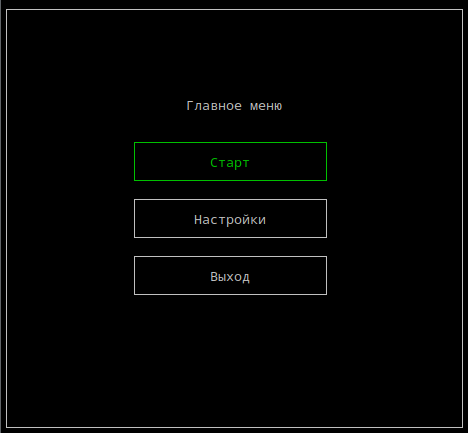

# exncwi
The library in the C programming language. Based on ncurses. Contains various functions that simplify working with pseudo-graphics.
# example

# TODO
- menus
- dialog windows
- mouse support
- ...
